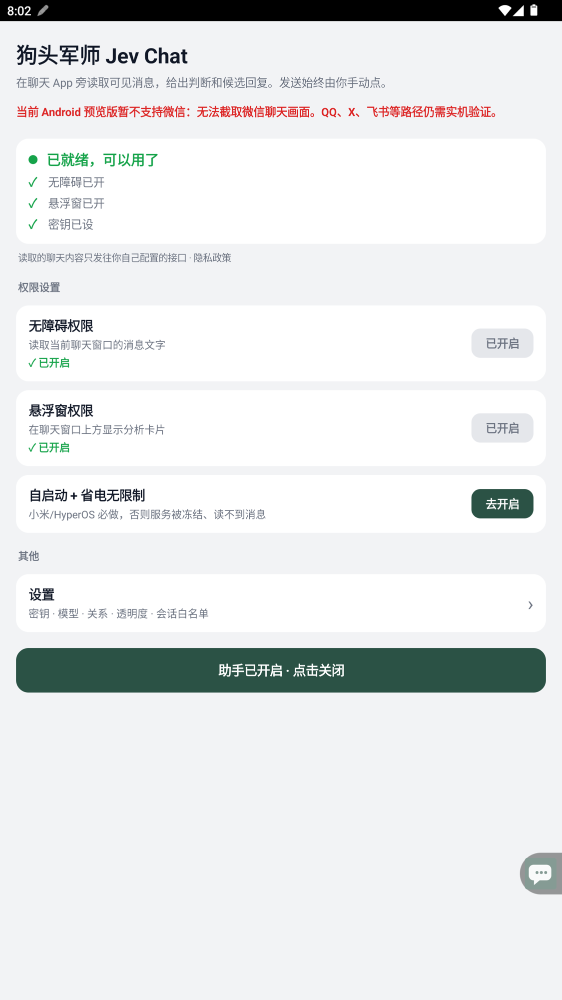
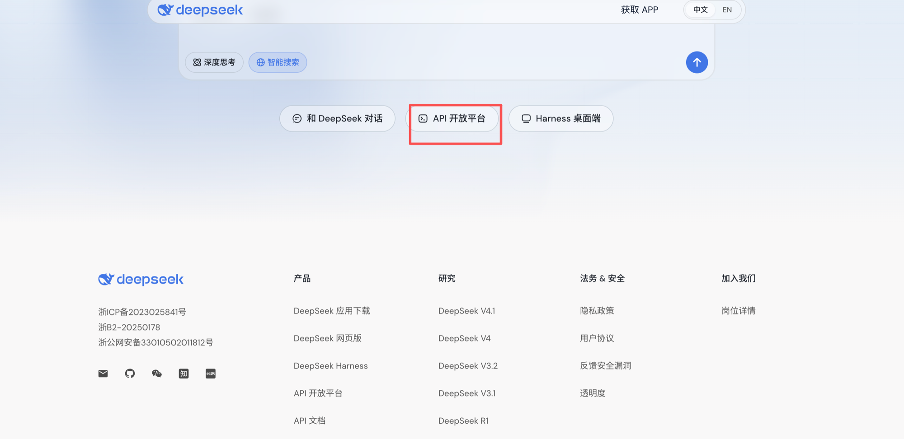
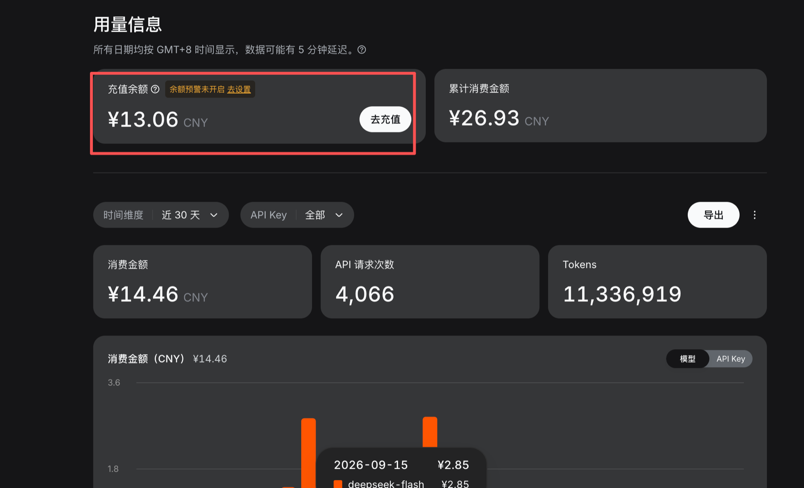
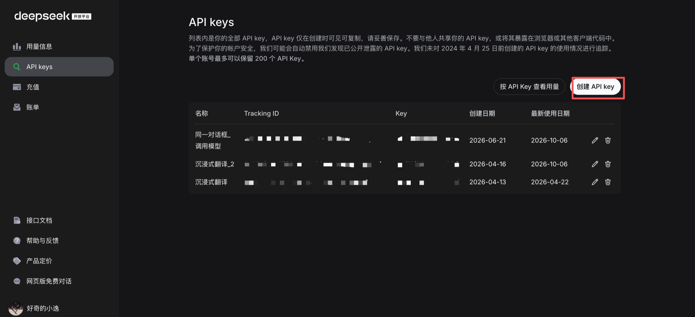
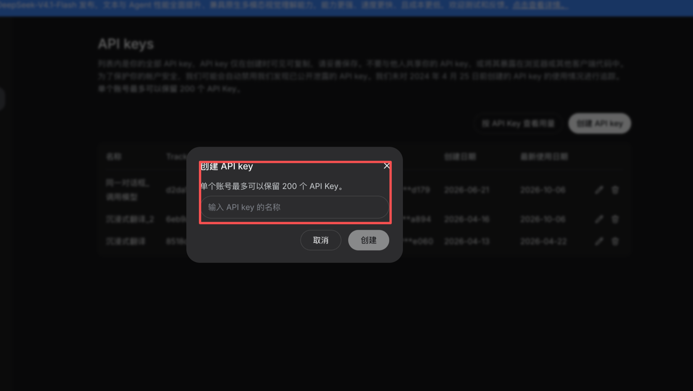
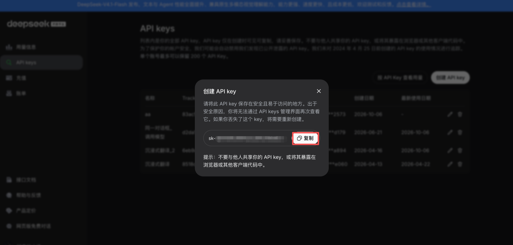
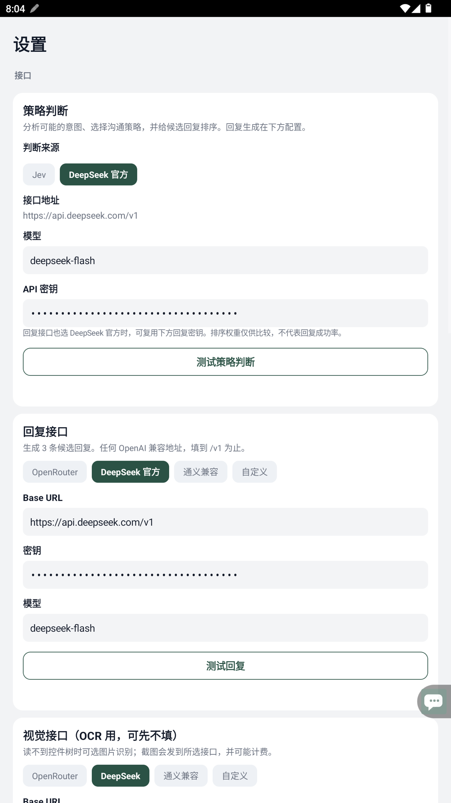
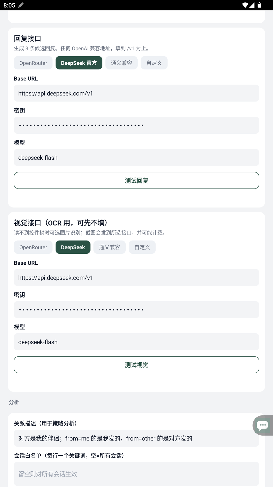
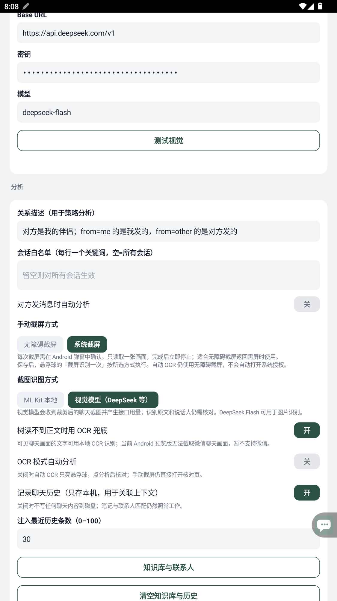
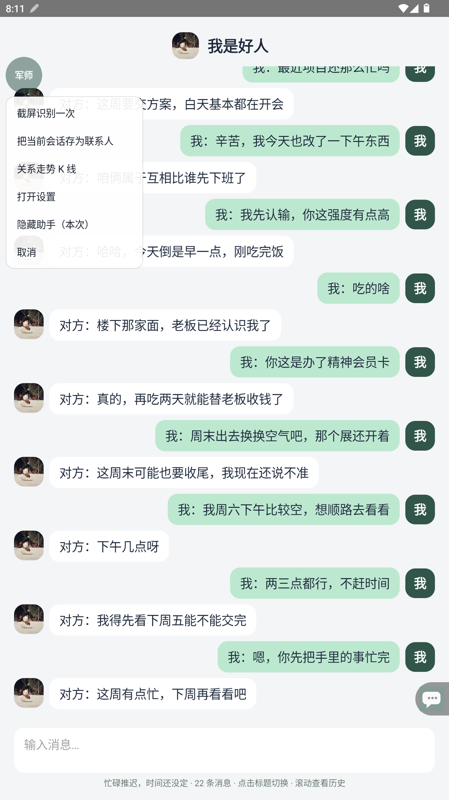

# 狗头军师到了安卓：只用 DeepSeek，怎么识别聊天、判断意图、生成回复？

之前，我把自己的恋爱 Skill「狗头军师」和 Jev 的聊天助手项目融合到了一起，做成了聊天窗口旁边的悬浮军师。

Mac 版已经写过了，这次讲安卓。

配置的时候，最容易混的是三个地方：判断用什么模型，回复用什么模型，截图又交给谁。界面里同时出现 Jev、DeepSeek、OpenRouter，第一次打开确实容易看懵。

**这篇就按一个配置来讲：识图、策略判断、回复生成，三处模型服务都用 DeepSeek。** 准备好自己的 DeepSeek API Key，照着页面填，不需要再准备 Jev 或 OpenRouter 的密钥。

从安装到拿到第一轮候选回复，下面走一遍。实际操作就以 **Soul 的聊天场景**为例，配置好以后，其他走通用截图流程的聊天应用也可以按同样的步骤尝试。

## 先说清楚：安卓目前能用在哪儿

**当前安卓预览版暂不支持微信。** 这个版本无法取得微信聊天画面，换成 DeepSeek 识图也解决不了取不到截图的问题。

QQ、X、飞书已有专门的采集适配。**Soul 使用通用的手动截屏识别流程**：把聊天显示在屏幕上，再从军师悬浮球发起识别。其他聊天应用也可以尝试这个入口，能否读取，取决于应用有没有限制截图，以及手机实际返回的画面。通用入口仍需在对应应用和手机上验证。

本文截图来自 **2026 年 10 月 6 日的本地更新版**。目前公开下载包是 `v0.1.7-preview`，已支持 DeepSeek 判断、回复和视觉接口配置；截图里的合并配置页、手动截屏方式选择尚未包含在该下载包里。旧版仍有独立的「判断接口（Jev）」卡片，选 DeepSeek 策略后，那张卡片可以留空。下文涉及「系统截屏」的设置，适用于本地更新版。

## 下载以后，先把悬浮球打开

手机需要 Android 11 或更新版本。

打开项目的 Releases 下载页面：

`https://github.com/shengjidaguai-china/goutoujunshi-jev-chat/releases/latest`

找到 `goutoujunshi-jev-chat-android-debug.apk`，下载并安装。系统如果提示允许浏览器安装此来源的应用，按手机提示操作。这是预览调试包；如果旧包提示签名不一致，卸载前先记下需要保留的配置，卸载会清掉应用本地数据。

安装后打开狗头军师，首页会列出需要开启的权限。



**无障碍权限**用于读取当前窗口里能访问到的文字，也供无障碍截屏使用。点击对应入口，在系统设置中找到狗头军师并开启服务。

**悬浮窗权限**用于把「军师」悬浮球放在聊天应用上方。部分手机把它叫作「显示在其他应用上层」。

如果手机经常把后台服务关掉，再按首页提示设置自启动和电池使用权限，尤其注意小米、HyperOS 的后台限制。

接着点首页的「设置」。接口填好并保存后，回到首页开启助手，就能看到「军师」悬浮球。截图中的「助手已开启·点击关闭」说明开关已经打开。

首页显示「已就绪」，代表基础权限和密钥条件满足；接口能不能调用，还要看下面的测试结果。

## 先把 DeepSeek 的 API 准备好：充值、创建、复制

如果还没有自己的 API Key，先做这一段。有 Key、账户里也有可用余额的，可以直接往下看应用配置。

我把开放平台里的几个入口也截了下来，第一次用照着找就行。

### 从官网进入 API 开放平台

打开 DeepSeek 官网：

`https://deepseek.com`

点击图里框出的 **「API 开放平台」**，按页面提示注册或登录。



也可以直接打开开放平台地址：

`https://platform.deepseek.com`

狗头军师调用的是 API。网页版聊天和 API 用量是两套使用入口，接下来要准备的是开放平台里的余额和密钥。

### 看余额，需要时点「去充值」

登录后打开 **「用量信息」**，这里能看到充值余额、消费金额、API 请求次数和 Tokens 用量。



需要补充余额时，点击 **「去充值」**，或者进入左侧的「充值」。在充值页选择金额，按页面提供的支付方式完成付款，再回到用量信息页确认余额。

充值金额、可选支付方式和价格，以你当时的开放平台页面为准。第一次可以先按自己的测试需求充值，跑通一轮以后再观察消耗。

图里的余额和用量是我截图时的账户数据，可能包含这个账号下其他工具的 API 调用，不能直接拿来计算狗头军师每次聊天的费用。后面识图、判断、生成回复和连通测试，都会产生接口用量。

### 创建一把自己的 API Key

在左侧点击 **「API keys」**，再点右上角的 **「创建 API key」**。



弹窗里先给密钥起个名字，比如 `狗头军师安卓`。这个名称方便以后管理，不用填模型名。



填好名称，点击 **「创建」**。

### 复制密钥，再回狗头军师配置

创建成功后，点击弹窗里的 **「复制」**，把完整密钥保存好。



**完整密钥只在创建时显示，关掉弹窗以后，管理页无法再次查看它。** 忘记保存时需要重新创建一把。

这串 Key 就是后面狗头军师设置里的「API 密钥」或「密钥」。不要把密钥名称、开放平台网址填进这个框；也别把完整 Key 放进文章、聊天截图或 GitHub。这里的截图已经把密钥遮住了。

现在回到狗头军师的「设置」，把刚复制的 Key 填进去。

## DeepSeek 要填三处，分工不同

刚才创建的同一把 Key，可以用于下面三个位置。它们各自负责不同的工作：

| 环节 | 设置页选择 |
| --- | --- |
| 判断对话意图、选择下一步策略 | 策略判断 → DeepSeek 官方 |
| 写出候选回复 | 回复接口 → DeepSeek 官方 |
| 从截图读取聊天内容 | 视觉接口 → DeepSeek |

三处都使用以下地址和模型：

接口地址：`https://api.deepseek.com/v1`

模型名称：`deepseek-flash`

这是当前这套配置使用的模型名，照着填即可。DeepSeek 官方图像理解文档已说明这个模型支持图片输入，所以它也可以放在视觉接口里。

### 策略判断和回复，先填好这两块



在「策略判断」里，把「判断来源」选成 **DeepSeek 官方**，模型填 `deepseek-flash`，API 密钥填自己的 Key。

这一块负责结合对话做判断：对方可能表达了什么，这一轮适合承接、降压、澄清，还是先收线。它会区分能从聊天里看见的事实和仍然拿不准的部分。

往下找到「回复接口」，同样选 **DeepSeek 官方**，核对 Base URL，填密钥和模型。

这一块负责把前面的策略写成可以直接拿来参考的短回复，最多给出三条候选。

**为了第一次配置省事，三个密钥框都填同一个 DeepSeek Key 就行。** 程序也支持在同一官方服务下复用回复密钥，第一次使用可以先不折腾这个选项。

截图里两块分别有「测试策略判断」「测试回复」按钮。旧版的策略测试按钮叫「测试 DeepSeek 策略」。填写后可以分别测试，哪一块报错就检查那一块。

### 识图还得再配一块



继续往下，找到「视觉接口（OCR 用，可先不填）」。

这里的“可先不填”，对应的是使用本地识图的情况。**如果打算连识图也用 DeepSeek，这块就要配好。**

选择 **DeepSeek**，Base URL 填 `https://api.deepseek.com/v1`，模型填 `deepseek-flash`，密钥填同一个 Key。然后点「测试视觉」。

视觉测试会发送一张小测试图片，用来检查图片请求是否能被接口接受。它不能保证每一张聊天截图都识别准确，真正使用时仍要核对文字。

三处测试都会调用接口，也会产生 API 用量。选云端识图后，聊天截图会发到你配置的 DeepSeek 服务；后续判断和回复也会发送用于分析的文字。

## 别漏了识图开关，也别忘了保存

接口填完，继续往下找到「分析」。



**把「截图识图方式」切到「视觉模型（DeepSeek 等）」。** 只在上面填了视觉接口，下面仍选「ML Kit 本地」，实际识图就会走本地模型。

ML Kit 本地是另一种可选方式，图片文字识别在手机上完成。想把这轮的识图、判断和回复都交给 DeepSeek，就按截图选视觉模型。「树读不到正文时用 OCR 兜底」保持开启。

这里还有一个容易混淆的设置：**截屏方式决定怎么取得图片，识图方式决定取得图片后交给谁来读。**

本地更新版提供两种手动截屏方式：

- **无障碍截屏**：使用已经开启的无障碍服务，正常情况下不用每次重新确认截屏授权。
- **系统截屏**：通过 Android 的截屏授权流程取一张画面，每次手动操作都要确认系统弹窗；取得画面后就停止投射。

如果无障碍截屏返回黑图，可以在本地更新版中改选系统截屏。这个选择不能跳过 Android 授权，也不能保证所有模拟器、受保护页面都能截到图。旧下载包没有这个选项时，按它现有的无障碍截屏路径使用。

第一次配置，建议先关掉「对方发消息时自动分析」和「OCR 模式自动分析」，先手动走通一轮。这两个自动开关关闭，也不影响你主动点击「截屏识别一次」。通用 OCR 应用先按手动流程使用。

「关系描述」也建议改成实际情况。页面默认写着“对方是我的伴侣”，如果你们还在了解中，照着默认值分析就容易带偏。可以写：

> 我们认识两周，正在了解中。我希望自然接话，对方忙的时候先不追问见面安排。

这个字段是在补充关系和本轮目标，写清楚就够了。

**最后滑到页面最底部，点「保存全部设置」。** 测试按钮能读取当前表单，日常使用读取的是保存后的配置；测试成功以后也要保存。

## 以 Soul 为例：打开聊天，长按悬浮球

回到狗头军师首页确认助手开启，再打开 **Soul**，进入想分析的那个人的聊天窗口，把相关的几条消息显示在屏幕上。

Soul 这条路径使用前面保存的 DeepSeek 配置，不需要另外填 Soul 的接口或密钥。先按手动流程操作，自动分析开关不等于 Soul 已有新消息自动采集适配。

**长按「军师」悬浮球，选择「截屏识别一次」。**



这张配图用本地聊天预览页展示悬浮球和按钮位置，Soul 从同一个菜单进入。

本地更新版如果选择了「系统截屏」，此时会出现 Android 的授权弹窗，按系统提示确认并返回原聊天界面。

识别后会打开原文核对页。先检查有没有漏字、错字，再检查哪些是自己发的，哪些是对方发的。每行按下面这种格式整理：

```text
我：周六一起去看展吗？
对方：这周有点忙，下周再看看吧。
```

检查好以后，点 **「确认原文并分析」**，让程序回到原来的 Soul 聊天窗口继续分析。这个时候先别切去别的软件或别人的会话，避免当前对话和分析对象对不上。

截图只覆盖屏幕上看得见的内容。如果重要背景在前面的聊天里，先把相关部分显示出来再识别，或者在关系描述里补充。它不会直接读出整份聊天数据库。

## 拿到结果以后，怎么看、怎么回

结果里可以看「对方可能的意图」、军师建议，以及「候选回复排序」。

候选旁边的百分比表示这轮回复的**相对推荐权重**。DeepSeek 给候选打分后，程序将分数归一化，方便比较。分数更高的排在前面；它不能解释成发出去以后有多少概率成功。

「判断把握」也是模型对当前判断的估计。聊天原文、说话人或背景填错了，带着百分比的判断一样可能偏。

想多看一点，就点「详细分析」，看它依据了哪些事实、哪些只是推测，以及还有什么未知。每条候选的「为什么这样回」可以看选择理由；觉得措辞不像自己，可以点「更像我一点」，再挑一句顺口的。

**在 Soul 里，选好候选后点「复制」，回到聊天输入框长按粘贴，检查一下再发送。** Soul 走通用 OCR 路径，程序无法验证它的输入框，点击「填入」也会退回复制。支持填入的专门适配应用会尝试放入草稿，发送仍然由你自己点。

## 用起来之前，再看三个小地方

**悬浮球不见了**：回首页检查助手开关、无障碍和悬浮窗权限。用一会儿就消失，再检查手机有没有关闭后台服务。

**接口报错**：核对三处选项、地址、模型名和密钥，再分别测试。出现「策略判断格式不正确」时，本轮不会继续生成候选，可以重试；持续报错需要保留错误提示排查，别把错误当作没有回复建议。

**截屏全黑**：权限开启也可能遇到黑图。先换一个允许截图的普通页面判断是否是当前应用限制；本地更新版可以切换手动截屏方式。微信仍在当前安卓版不支持的范围里，模拟器也可能出现黑图或裁切。

另外，「记录聊天历史」是可选的。开启后，匹配到你保存的联系人时，本程序用于分析的可见对话可以在本机保存，用于关联上下文；分析时选取的历史仍会发给模型。它不会自动导入聊天应用的全部历史。先关着使用也可以，后面有需要再开。

这次把配置和入口写细一点，就是希望大家拿到 APK 后，能知道每一处该填什么，怎样得到第一轮可用的回复建议。

狗头军师里我想保留的东西，也都在这个流程里：看事实、留余地、给下一步，把回复写得自然一点。看完建议，再决定自己怎么说。

项目地址：

`https://github.com/shengjidaguai-china/goutoujunshi-jev-chat`

DeepSeek 官方图像理解说明（本文于 2026 年 10 月 6 日核对）：

`https://api-docs.deepseek.com/zh-cn/guides/vision/`
